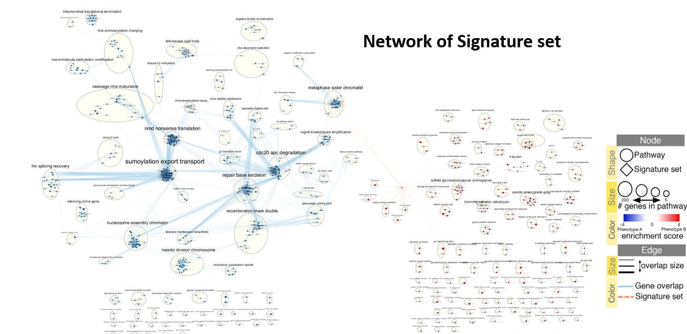

By Jongmin Lim
BCB420

# Pathway and Network Analysis #
<br>

# Intro #
The purpose of this analysis is to identify the transcriptomic difference between iPSC and iPSC derived astrocyte. There are 5 patients of iPSC cell and corresponding iPSC derived astrocyte. After load raw data, data has been filtering based on feature a leat 1 read per million in n of the samples, n as the size of the smallest groups of replicates, which is 2 replicates. After filtering, trimm mean of m value, and log normalize the data, HUGO symboles mapped to the corresponding gene. Gene with NA as HUGO symboles removed. And later, all gene with no HUGO symboles is removed.

Limma-Trend and Negative Binomial Generalized LInear Models with Quasi-likelihood test from limma v3.40.6 and edgeR package v3.26.8 perfomred for differnetial gene expression analysis. 9977 genes met the thresdhol for statistical significance with P value less than 0.05. 8684 genes pass the correction. Differential genes, upregualted and downregualted, analyzed with thresholded overrepresentation analysis using g:profiler. The heatmap result shows the clusters of gene that differentiate between iPSC and iPSC derived astrocyte.

GSEA will be use as non-thresholded pathwasy analysis and use cytoscape with enrichment map pipiline to summarize tand visualize the results.


# Install required packages#
```{r, result='hide', message=FALSE, warning = FALSE}
if (!requireNamespace("colorRamps", quietly=TRUE)) {
  install.packages("colorRamps")
}
if (!requireNamespace("doBy", quietly=TRUE)) {
  install.packages("doBy")
}
if (!requireNamespace("gprofiler2", quietly=TRUE)) {
  install.packages("gprofiler2")
}
if (!requireNamespace("colorRamps", quietly=TRUE)) {
  install.packages("colorRamps")
}
#install required R and bioconductor packages
tryCatch(expr = { library("RCurl")}, 
         error = function(e) {  install.packages("RCurl")}, 
         finally = library("RCurl"))

#use library
tryCatch(expr = { library("limma")}, 
         error = function(e) { source("https://bioconductor.org/biocLite.R")
           biocLite("limma")}, 
         finally = library("limma"))
tryCatch(expr = { library("Biobase")}, 
         error = function(e) { source("https://bioconductor.org/biocLite.R")
           biocLite("Biobase")}, 
         finally = library("Biobase"))
tryCatch(expr = { library("ggplot2")}, 
         error = function(e) { install.packages("ggplot2")}, 
         finally = library("ggplot2"))

#For creating json and communicating with cytoscape
tryCatch(expr = { library("httr")}, 
         error = function(e) { install.packages("httr")}, 
         finally = library("httr"))
tryCatch(expr = { library("RJSONIO")}, 
         error = function(e) { install.packages("RJSONIO")}, 
         finally = library("RJSONIO"))
```
<br>

## Load library ##
```{r test-child, result='hide', message=FALSE, warning = FALSE}
#List of packages that need to be active for this project
library(GEOmetadb)
library(knitr)
library(tidyr)
library(biomaRt)
library(edgeR)
library(BiocGenerics)
library(ComplexHeatmap)
library(circlize)
library(colorRamps)
library(dplyr)
library(doBy)
library(gprofiler2)
library(kableExtra)
library(limma)
```
<br>

# Background Information #

This dataset is RNAseq expression of iPSC and iPSC-dervied Astrocyte. The purpose of this database is to validate identity of iPSC-derived astrocyte by looking at expression RBA. This is important since they need to get correct cell type to proceed to experiment.

## Information about Platform GSE ##
```{r, message=FALSE}
#GEO description of of my dataset
gse <- getGEO("GSE116124", GSEMatrix=FALSE)
kable(data.frame(head(Meta(gse))), format = "html")
```

<br>

## More Information about dataset ##
```{r, message=FALSE, result='hide'}
current_gpl <- names(GPLList(gse))[1]
current_gpl_info <- Meta(getGEO(current_gpl))
```
<br>


**Platform Title:** `r current_gpl_info$title`\
**Original submission date:** `r current_gpl_info$submission_date`\
**Last update date:** `r current_gpl_info$last_update_date`\
**Organism:** `r current_gpl_info$organism`\
**No. of GEO datasets that use this technology:** `r length(current_gpl_info$series_id)`\
**No. of GEO samples that use this technology:** `r length(current_gpl_info$sample_id)`

<br>

# Downlaod and Organize #
## Download Data ##
- Get the expression Data
```{r, message=FALSE, result='hide', warning = FALSE}
#Asign the file
sfiles = getGEOSuppFiles('GSE116124')
fnames = rownames(sfiles)
cell_exp = read.delim(fnames[1], header=TRUE, check.names = FALSE)
```
<br>


- Load first 15 row of dataset with html table format
```{r}
#Load the dataset with html table format
kable(cell_exp[1:15,1:5], format = "html")
```
<br>

## Organize data ##

- ID_gene,gene_name, and gene_type are in one colums. 
- Need to divide into first 3 columns
```{r}
#Separate the first column in to 3 total based on the id, name,and type of gene
cell_exp <- separate(cell_exp, col = "id_gene,gene_name,gene_type", into = c("id_gene", "gene_name", "gene_type"), sep = "\\,")

#Assign the column names
colnames(cell_exp) <- list("ensembl_gene_id", "gene_name", "gene_type", 
                           "iPSC.A", "iPSC.B",    
                           "hASTRO.E", "hASTRO.E",
                           "hASTRO.A","hASTRO.B",
                           "hASTRO.C", "hASTRO.D",
                           "iPSC.C", "iPSC.D")
#Remove unessacry data for this comparison
cell_exp <- cell_exp[,-(6:7)]

#Need to remove decimal point so I can map identifiersd without version
cell_exp$ensembl_gene_id  <- gsub(pattern = "\\.\\d+$", replacement = "", x = cell_exp$ensembl_gene_id, ignore.case = TRUE)
```
<br>

## Filtering ##

- Need to filter out geens that have low counts
- In edgeR, recommended to remove features wihtout at least 1 read per million
- My sample has 5 groups and 2 replicates
```{r}
#Change to count per million
cpms = cpm(cell_exp[,4:11])
#Set the rowname of first colum of cell_exp dataset
rownames(cpms) <- cell_exp[,1]
#Remove 1 or lower read per million.
#Keep the replicate group that equal or greater than 2
keep = rowSums(cpms >1) >=2
cell_exp_filtered = cell_exp[keep,]
```

## Define the group ##

- Cell type with corresponding GSM number can be find in this link and gse [link](https://www.ncbi.nlm.nih.gov/geo/query/acc.cgi?acc=GSE116124)
- Divide into 2 groups since there is 2 replicates 
- Open the gse file directly and identify the cell type with correspoding sample code (AD####).
```{r}
#Define the group
samples <- data.frame(
           lapply(colnames(cell_exp)[4:ncol(cell_exp)],
           FUN=function(x){
             unlist(strsplit(x, split = "\\."))[c(1,2)]})) #Separate based on "."
#Separate columns based on cell type and patient
colnames(samples) <- colnames(cell_exp)[4:ncol(cell_exp)]
rownames(samples) <- c("cell_type", "patient")
samples <- data.frame(t(samples))
samples
```
<br>

# Normalization #

## Applying TMM to dataset ##

- Trimmed mean: average after remove upper and lower percentage of the data points
- By default, 30% of the M values and 5% of the A values
- TMM compare each sample to a reference
- Data does not need to be modified prior to normalization

```{r}
#Convert data.frame to matrix
#Need to make sure that use filtered count and matrix
filtered_data_matrix <- as.matrix(cell_exp_filtered[, 4:11])
rownames(filtered_data_matrix) <- cell_exp_filtered$ensembl_gene_id#Add rownames

#Define group as cell type to compare
tmMreq = DGEList(counts = filtered_data_matrix, group = samples$cell_type)

#Calculate normalization factors
tmMreq = calcNormFactors(tmMreq)

#Get normalized data
normalized_counts <- cpm(tmMreq)
```
<br>


## Two boxplots ##

- Comparison between normalized and not normalized data with box plots
- There is some difference between two plots
- Median of each samples are more equal to each other in normalized box plots.
- I don't think interquartile range changed
```{r, warning = FALSE}
#Separate the area to load 2 graphs
par(mfrow= c(1,2))

#Not normalized boxplot
data2plot <- log2(cpm(cell_exp_filtered[,4:11]))
boxplot(data2plot, xlab = "Samples", ylab = "log2 CPM",
        las = 2, cex = 0.5, cex.lab = 0.5,
        cex.axis = 0.5, main = "Cell RNAseq Samples")
#draw the median of each box plot
abline(h = median(apply(data2plot, 2, median)), col = "green", lwd = 0.6, lty = "dashed")

#Normalized boxplot
data2plot <- log2(normalized_counts[,1:7])
boxplot(data2plot, xlab = "Samples", ylab = "log2 CPM",
        las = 2, cex = 0.5, cex.lab = 0.5,
        cex.axis = 0.5, main = "Normalized Cell RNAseq Samples")
#draw the median of each box plot
abline(h = median(apply(data2plot, 2, median)), col = "green", lwd = 0.6, lty = "dashed")
```
<br>

## Two density graphs ##

- Comparison between normalized and not normalized data with density graphs
- There is some difference between two plots
- Each line in normalized data are closer together compare to not normalized data except hole that located in around range 0 get bigger.
- Location of lines in normalized data are different compare to not normalized data

```{r}
#Separate the area to load 2 graphs
par(mfrow= c(1,2))

#Not normalized data (left)
counts_density <- apply(log2(cpm(cell_exp_filtered[, 4:11])), 2, density)
#Calculate the limits across all the samples
xlim <- 0; ylim <- 0
for (i in 1:length(counts_density)){
  xlim <- range(c(xlim, counts_density[[i]]$x));
  ylim <- range(c(ylim, counts_density[[i]]$y))
}
cols <- rainbow(length(counts_density))
ltys <- rep(1, length(counts_density))
#plot the first density plot to initialize the plot
plot(counts_density[[1]], xlim=xlim, ylim=ylim, type="n",
     ylab="Smoothing density of log2-CPM", main = "Cell RNAseq Samples", cex.lab = 0.85)
#plot each line
for (i in 1:length(counts_density)) lines(counts_density[[i]], col=cols[i], lty=ltys[i])
#create legend
legend("topright", colnames(data2plot),
       col=cols, lty=ltys, cex=0.75,
       border = "blue", text.col = "green4",
       merge = TRUE, bg = "gray90")

#Normalized data (right)
normalized_density <- apply(log2(normalized_counts[, 1:7]), 2, density)
#Calculate the limits across all the samples
xlim <- 0; ylim <- 0
for (i in 1:length(normalized_density)){
  xlim <- range(c(xlim, normalized_density[[i]]$x));
  ylim <- range(c(ylim, normalized_density[[i]]$y))
}
cols <- rainbow(length(normalized_density))
ltys <- rep(1, length(normalized_density))
#plot the first density plot ot initialize the plot
plot(normalized_density[[1]], xlim=xlim, ylim=ylim, type="n",
     ylab="Smoothing density of normalized log2-CPM", main = "Normalized Cell RNAseq Samples", cex.lab = 0.85)
#plot each line
for (i in 1:length(normalized_density)) lines(normalized_density[[i]], col=cols[i], lty=ltys[i])
#create legend
legend("topright", colnames(data2plot),
       col=cols, lty=ltys, cex=0.75,
       border = "blue", text.col = "green4",
       merge = TRUE, bg = "gray90")
```
<br>

## MDS plot ##

- MDS plot represent the distance between samples
- Closer distence mean similar in RNAseq
- iPSC cluster together. Even if they come from different patient, because of gaining pluripotency by force to express specific genes lead to increasing similarity
- Astrocyte (hASTRO) are cluster in 2 but seperated. This might happen because one group should be patient with Parkinson disease while another group is without Parkinson disease

```{r}
#MDS plot to see the distance between samples
plotMDS(tmMreq, labels=rownames(samples),
        main = "MDS Plot of Samples",
        col = c("darkgreen", "darkblue")[factor(samples$cell_type)])
```
<br>


## Estimate common and tagwise dispersion ##

- Dispersion describe how much variance deviated from teh mean
- Specific to edgeR and used downstream when calculating differential expression
- Can estimate common and tagwise disperison
- Common dispersion calculate common disperions values
- Tagwise dispersion calculate gene-specific disterpsion

```{r}
#Estimate common and tagwise dispersion
model_design <- model.matrix(~ samples$patient) 
dispersion <- estimateDisp(tmMreq, model_design)
```
<br>


## Plot BCV ##

- Dispersion squared is biological coefficient of variation (BCV)
- Dispersion is a measrue of vriation within samples
- Each dot represent BCV for each gene
- Red line represent common dispersion
- Blue line represent the trend of dataset
- All the Tagwise are within common and trend line, which is good
```{r}
#Plot BCV with sample
plotBCV(dispersion, col.tagwise = "black", col.common = "red", main = "Biological Coefficient of Variation of Samples")
```
<br>


## Plot mean variable relationship ##

- Gray dots are raw varaince of the counts
- Blue dots are estimated varaince by using tagwise dispersion
- Red x are variance binned common dispersion
- Dark red x are average of the raw varaince of each bin of genes
- Blue line is mean variance related to negative binomial distribution with common dispersion
- All the line, x, and dots are in same trend within NBline, which is good
- I got information from this webpage [link](https://www.rdocumentation.org/packages/edgeR/versions/3.14.0/topics/meanvar)

```{r}
#Separate the area to load 2 graphs
par(mfrow= c(1,2))
plotMeanVar(dispersion, 
            show.raw.vars = TRUE,                    
            show.tagwise.vars=TRUE,                  
            NBline=TRUE,                             
            show.ave.raw.vars = TRUE,                
            show.binned.common.disp.vars = TRUE,
            main = "Mean-Variance Relationship of Samples")
```
<br>

# Map to HUGO symbols #

## Biomart ##

- Important to working with up to date annotations and the right versions
```{r}
#Connect to ensembl mart and limit to human datasets
#Using grch37 because I keep get error when using most updated ensembl
ensembl <- useMart("ensembl", dataset = "hsapiens_gene_ensembl", host="grch37.ensembl.org")
```
<br>


## Converting Human Ensembl Gene Ids to HGNC symbols ##

- Attribute: Ensembl gene Ids and HGNC symbols
- Filter: Ensembl gene ids
- Values: Ensembl gene ids
```{r, message=FALSE}
#Filter
biomart_human_filters <- listFilters(ensembl) #Will go with ensembl_gene_id_version since my dataset contain version

#Attributes
kable(searchAttributes(mart = ensembl, 'hgnc') , format="html") #Will go with hgnc_symbol
```
<br>


```{r , result='hide'}
#Check to see if cell_id_conversion file exists
conversion_stash <- "cell_id_conversion.rds"
if(file.exists(conversion_stash)){
  cell_id_conversion <- readRDS(conversion_stash)
}else{
  cell_id_conversion <- getBM(attributes =
                              c("ensembl_gene_id", "hgnc_symbol"),
                              filters = c("ensembl_gene_id"),
                              values = factor(cell_exp_filtered$ensembl_gene_id),  #Values is first colum of my expression matrix
                              mart = ensembl)
  saveRDS(cell_id_conversion, conversion_stash)
}
```
<br>

## Merge new identifier ##
```{r }
#Merge the new identifier
normalized_counts_annot <- merge(cell_id_conversion, normalized_counts, by.x = 1, by.y = 0, all.y = TRUE)
kable(normalized_counts_annot[1:5,1:5],type = "html")
```
<br>

## Number of missing identifiers ##
```{r }
#Number of identifier are missing
ensembl_id_missing_gene <- normalized_counts_annot$ensembl_gene_id[
  which(is.na(normalized_counts_annot$hgnc_symbol))]
length(ensembl_id_missing_gene)
#Yes. (489/16993) = 0.029. About 2.9% of my dataset miss identifiers.
```
<br>


## Table of gene that miss identifier as NA ##

- Some of gene has NA or empty string for hgnc_symbol, which can be novel transcription or common gene. Therefore, I would like to keep these gene instead of remove the them
```{r }
#Collect all the duplicate of hgnc_symbol
hugoDuplicated <- normalized_counts_annot[duplicated(normalized_counts_annot$hgnc_symbol), 1:2]

#Collect all the non empty string for hgnc_synbol
hugoEmptyDuplicated <- hugoDuplicated[!(nchar(hugoDuplicated$hgnc_symbol) == 0),]

#Collect all the non NA for hgnc_synbol
nohugoEmptyNADuplicated <- hugoEmptyDuplicated[!is.na(hugoEmptyDuplicated$hgnc_symbol),]

#Only remove gene with NA in hgnc_symbol
finalized_dataset <- normalized_counts_annot
head(finalized_dataset)
```

# Differential Gene Expression #

## Apply New Normalization ##
```{r, result='hide', message=FALSE, warning = FALSE}
#Normalize the data
finalized_dataset %>%
  mutate_at(vars(-ensembl_gene_id, -hgnc_symbol), funs(.+1)) %>%
  mutate_at(vars(-ensembl_gene_id, -hgnc_symbol), funs(log2(.))) -> new_normalized_count_data

#Remove any duplicate ensembl_gene_id
new_normalized_count_data <- new_normalized_count_data[!duplicated(new_normalized_count_data$ensembl_gene_id),]
```
<br>

```{r}
#Check
kable(new_normalized_count_data[1:10,], type="html")%>%
  kable_styling(bootstrap_options = "striped", full_width = F)
```
<br>

## Numerical matrix ## 
```{r}
#Numerical matrix for heatmap
heatmap_matrix <- new_normalized_count_data[,3:ncol(new_normalized_count_data)]

#Assign rowname by ensemble_gene_id
rownames(heatmap_matrix) <- make.names(new_normalized_count_data$ensembl_gene_id, unique=TRUE)

#Assign colnames by gene names
colnames(heatmap_matrix) <- colnames(new_normalized_count_data[,3:ncol(new_normalized_count_data)])
```
<br>

## Linear model ##

- Create a design matrix, which need to create linear model
```{r}
#Model design based on samples cell type
model_design <- model.matrix(~samples$cell_type)

#Show the table
kable(model_design, type="html") %>%
  kable_styling(bootstrap_options = "striped", full_width = F)
```
<br>

- Create data matrix
- Website that explain about assayData [@ExpressionSet]
```{r}
#Create matrix that contain infomration of normalized data from column 3 to end
expressionMatrix <- as.matrix(new_normalized_count_data[,3:ncol(new_normalized_count_data)])

#Ensemble gene as row name
rownames(expressionMatrix) <- new_normalized_count_data$ensembl_gene_id

#Set column name based on normalized data
colnames(expressionMatrix) <- colnames(new_normalized_count_data)[3:ncol(new_normalized_count_data)]

#Create minimal set by using assayData, which must contain a matrix expression with rows and representing features and columnes representing samples
minimalSet <- ExpressionSet(assayData=expressionMatrix)

#Fit data to the above model
fit <- lmFit(minimalSet, model_design)
```
<br>

- Apply empirical Bayes to compute differential expression for the above described model
- The parameter trend=TRUE is specific to RNA-seq data
- I use BH threshold to reduce the false discovery rate, which will avoid type 1 error. The other adjust method are too extreme that either increase false negative or false positive for this data. [@BH]
```{r}
#Apply empitical bayes to fit data
ebayes_fit <- eBayes(fit, trend=TRUE)

#Collect the data that adjust method, which is BH, applied
topfit <- topTable(ebayes_fit,
                   coef=ncol(model_design),
                   adjust.method = "BH",
                   number = nrow(expressionMatrix))

#Merge hgnc names to topfit table
output_hits <- merge(new_normalized_count_data[,1:2],
                     topfit,
                     by.y = 0, by.x = 1,
                     all.y = TRUE)
#Sort by pvalue
output_hits <- output_hits[order(output_hits$P.Value),]
#Table

kable(output_hits[1:10,], type="html") %>%
  kable_styling(bootstrap_options = "striped", full_width = F)
```
<br>

- 10741 of genes pass the threshold p-value <0.05.
```{r}
length(which(output_hits$P.Value < 0.05))
```
<br>

- 9869 genes pass correction
```{r}
length(which(output_hits$adj.P.Val < 0.05))
```
<br>

# Multiple Hypothesis Test #

## Design matrix ##
- When number of tests performed increases, a false positive might increase
- Multiple hypothesis testing will come up for differential expression, pathways analysis, and for any analysis where there are multiple tests being performed
- Control for family-wise error rate or for false discovery rate
```{r}
#Create a design matrix
model_design_pat <- model.matrix(
  ~samples$patient + samples$cell_type) #Design matrix based on cell type and sample group
#Check the matrix
table_model_design_pat <- as.data.frame(model_design_pat)
table_model_design_pat
```
<br>

- fit data to the model_design_cell
```{r}
fit_pat <- lmFit(minimalSet, model_design_pat)
```
<br>

## Differential Expression ##
- Apply empirical Bayes to compute differential expression for the above described model
```{r}
#The parameter trend = TRUE is specific to RND-seq data
ebayes_fit_pat <- eBayes(fit_pat, trend = TRUE)
topfit_pat <- topTable(ebayes_fit_pat,
                       coef = ncol(model_design_pat),
                       adjust.method = "BH",
                       number = nrow(expressionMatrix))

#Merge hgnc names to topfit table
output_hits_pat <- merge(new_normalized_count_data[, 1:2],
                         topfit_pat, by.y=0, by.x=1, all.y=TRUE)
#Sort by pvalue
output_hits_pat <- output_hits_pat[order(output_hits_pat$P.Value),]

#Check
kable(output_hits_pat[1:10,], type="html")%>%
  kable_styling(bootstrap_options = "striped", full_width = F)
```
<br>

- 10263 genes pass the threshold p-value < 0.05
- 10263 significantly differential expressed
```{r}
length(which(output_hits_pat$P.Value < 0.05))
```
<br>

- 0 genes pass the threshold correction
```{r}
length(which(output_hits_pat$adj.P.Value < 0.05))
```
<br>

- Use Quasi to calculate differential expression genes
```{r}
#Set up edgeR objects
edge_obj = DGEList(counts=filtered_data_matrix, group=samples$cell_type)

#Estimate Dispersion - our model design
edge_obj <- estimateDisp(edge_obj, model_design_pat)

#Fit the model
fit <- glmQLFit(edge_obj, model_design_pat)
```
<br>

- Calculate differential expression using the Quasi likelihood model
```{r}
qlf.iPSC_vs_hASTRO <- glmQLFTest(fit, coef='samples$cell_typeiPSC')

#plot the table
topTags(qlf.iPSC_vs_hASTRO)
```
<br>

- Grab all the results
```{r}
qlf_output_hits <- topTags(qlf.iPSC_vs_hASTRO, 
                           sort.by = "PValue",
                           n = nrow(new_normalized_count_data),
                           adjust.method = "BH")  #Use BH as adjust method for this assignment
```
<br>

- 10217 genes pass the threshold p-value < 0.05, which indicates that 10127 genes are significantly differentially expressed
- I use threshold p-value less than 0.05 because it is significant enough to get differently expressed genes
```{r}
length(which(qlf_output_hits$table$PValue < 0.05))
```
<br>

- 9042 genes pass the correction
```{r}
length(which(qlf_output_hits$table$FDR < 0.05))
```
<br>

```{r}
#Calculate normalization factors
edge_objs <- calcNormFactors(edge_obj)

#Dit model
fits <- glmQLFit(edge_objs, model_design_pat)

#calculate differential expression
qlf.hiPSC_vs_hASTRO <- glmQLFTest(fits, coef='samples$cell_typeiPSC')
```
<br>

- Get all the result
```{r}
qlf_output_hit <- topTags(qlf.hiPSC_vs_hASTRO,sort.by = "PValue",
                          n = nrow(new_normalized_count_data),
                          adjust.method = "BH")
```
<br>

- 9977 genes pass the threshold p-value < 0.05
```{r}
length(which(qlf_output_hit$table$PValue < 0.05))
```
<br>

- 8684 genes pass correction
```{r}
length(which(qlf_output_hit$table$FDR < 0.05))
```
<br>

- Output top
```{r}
topTags(qlf.hiPSC_vs_hASTRO)
```
<br>

- 4930 genes are up regulated (downregulated when differentiate iPSC to astrocyte)
```{r}
length(which(qlf_output_hit$table$PValue < 0.05 & qlf_output_hit$table$logFC > 0))
```
<br>

- 5047 genes are down regulated (upregulated when differentiate iPSC to astrocyte)
```{r}
length(which(qlf_output_hit$table$PValue < 0.05 & qlf_output_hit$table$logFC < 0))
```
<br>

```{r}
#merge gene names with the top hits
qlf_output_hits_withgn <- merge(new_normalized_count_data[,1:2],qlf_output_hit, by.x=1, by.y = 0)
qlf_output_hits_withgn[,"rank"] <- -log(qlf_output_hits_withgn$PValue,base =10) * sign(qlf_output_hits_withgn$logFC)
qlf_output_hits_withgn <- qlf_output_hits_withgn[order(qlf_output_hits_withgn$rank),]
```


## Volcano plot ##

- Upregulated genes (red) are located mostly lower side of graph while upregulated genes (blue) are located upper side of graph.
- Gene of interest (orange), which is part of upregulated gene, is located lower side of graph.
- No differentailly expressed genes (grey) are located at middle, which indicates that iPSC and ipsc-derived astrocyte express these gene in similar level.
```{r}
#P values from data that apply multiple hypothesis testing
qlf_cell_model_pvalues <- data.frame(ensembl_id = rownames(qlf_output_hits$table),
                                     qlf_cell_pvalue=qlf_output_hits$table$PValue)

#downregulated when differentiate iPSC to astrocyte
downregulated_gene <- qlf_output_hits_withgn[which(qlf_output_hits_withgn$PValue < 0.05 & qlf_output_hits_withgn$logFC > 0),]
upregulated_gene <- qlf_output_hits_withgn[which(qlf_output_hits_withgn$PValue < 0.05 & qlf_output_hits_withgn$logFC < 0),] 

#Plot for gene of interest CD44
ensembl_of_interest <- new_normalized_count_data$ensembl_gene_id[
                       which(new_normalized_count_data$hgnc_symbol == "CD44")]

#Downregulated gene ensembl_id 
downregulated_gene <-  data.frame(ensembl_id = downregulated_gene$ensembl_gene_id)

#Upregualted gene ensembl_id
upregulated_gene <-  data.frame(ensembl_id = upregulated_gene$ensembl_gene_id)

qlf_cell_model_pvalues$colour <- "grey" #Grey for all genes
qlf_cell_model_pvalues$colour[upregulated_gene$ensembl_id] <- "red" #Red for upregulated
qlf_cell_model_pvalues$colour[downregulated_gene$ensembl_id] <- "blue" #Blue for downregulated
qlf_cell_model_pvalues$colour[qlf_cell_model_pvalues$ensembl_id==ensembl_of_interest] <- "orange" #Orange for gene of interest

volcanoplot(ebayes_fit,
            coef = ncol(ebayes_fit),
            ylab = "M-ratio log expression",
            cex = ifelse(qlf_cell_model_pvalues$colour == "orange", 2, 0.3),
            col = qlf_cell_model_pvalues$colour,
            main = "Upregulated genes vs Downregulated genes")
```
<br>

## Heat Map ##

- Heat map of top hits using the Quasi likelihood model
- Heat map is graph that translate numbers into scale of color
- Good for summary of what are data looks like
- Same cell_type cluster together in heat map as we can see clear block of gene expression between iPSC and astrocyte.
- This can happen because author need to provide specific transcription factor to differentiate fibroblast to iPSC and iPSC to astrocyte. Since those specific transcription factors will significantly up or down regulated, the cluster would be more
```{r}
#Set top hit
top_hits <- rownames(qlf_output_hits$table)[output_hits_pat$P.Value<0.05]
#Set heatmap matrix tophits
heatmap_matrix_tophits <- t(
  scale(t(heatmap_matrix[which(rownames(heatmap_matrix) %in% top_hits),])))

#Sorth the column by cell type
#Organize by cell type
heatmap_matrix_tophits <- heatmap_matrix_tophits[, c(grep(colnames(heatmap_matrix_tophits), pattern = "^iPSC"),
                                                     grep(colnames(heatmap_matrix_tophits), pattern = "^hASTRO"))]

if(min(heatmap_matrix_tophits) == 0){
    heatmap_col = colorRamp2(c( 0, max(heatmap_matrix_tophits)), #if no negative value in heatmap matrix, 
                             c( "white", "red"))                 #use white and red color
  } else {
    heatmap_col = colorRamp2(c(min(heatmap_matrix_tophits), 0, max(heatmap_matrix_tophits)), c("blue", "white", "red")) #blue, white, red if heatmap matrix contain negative value
  }
#Plot
current_heatmap <- Heatmap(as.matrix(heatmap_matrix_tophits),
                           cluster_rows = TRUE,
                           cluster_columns = TRUE,
                           show_row_dend = TRUE,
                           show_column_dend = TRUE, 
                           col = heatmap_col,
                           show_column_names = TRUE, 
                           show_row_names = FALSE,
                           show_heatmap_legend = TRUE,
                           column_title  = "Heatmap for top hits")
current_heatmap
```
<br>


# Thresholded Over-Represenataion Analysis #

- Create thresholded lists of genes
- The RNAseq data has been reversed. I want to see the expression difference after differentiate the astrocyte. Therefore, I will have upregulated_gene as downregulated file and vice versa. 
```{r}
downregulated_genes <- qlf_output_hits_withgn$hgnc_symbol[
  which(qlf_output_hits_withgn$PValue < 0.05            #downregulated when differentiate iPSC to astrocyte 
             & qlf_output_hits_withgn$logFC > 0)]
upregulated_genes <- qlf_output_hits_withgn$hgnc_symbol[
  which(qlf_output_hits_withgn$PValue < 0.05 
             & qlf_output_hits_withgn$logFC < 0)]      #upregulated when differentiate iPSC to astrocyte
write.table(x=downregulated_genes,
            file="cell_downregulated_genes.txt",sep = "\t",
            row.names = FALSE,col.names = FALSE,quote = FALSE)    #save as downregulated file 
write.table(x=upregulated_genes,
            file="cell_upregulated_genes.txt",sep = "\t",
            row.names = FALSE,col.names = FALSE,quote = FALSE)   #save as upregulated file 
```
<br>


```{r}
#Check to make sure upregulated genes list contain the astrocyte specific gene
upregulated_genes_dataframe <- as.data.frame(upregulated_genes)
#List of gene that expressed in astrocyte
list_upregulated <- c(upregulated_genes_dataframe[upregulated_genes_dataframe == "CD44"],
                      upregulated_genes_dataframe[upregulated_genes_dataframe == "SOX9"],
                      upregulated_genes_dataframe[upregulated_genes_dataframe == "DIO2"])
#Remove NA
list_upregulated <- list_upregulated[!is.na(list_upregulated)]
list_upregulated
```
<br>

```{r}
#Check to make sure upregulated genes list contain the astrocyte specific gene
downregulated_genes_dataframe <- as.data.frame(downregulated_genes)
#List of gene that expressed in iPSC
list_downregulated <- c(downregulated_genes_dataframe[downregulated_genes_dataframe == "MYC"],
                      downregulated_genes_dataframe[downregulated_genes_dataframe == "NANOG"],
                      downregulated_genes_dataframe[downregulated_genes_dataframe == "SALL4"])
#Remove NA
list_downregulated <- list_downregulated[!is.na(list_downregulated)]
list_downregulated
```
<br>

# Non-thresholded Gene set Enrichment Analysis #

## What method did I use? ##

I use Gene Set Enrichment Analysis (GSEA) becuase it is currently most used method for non-thresholded analysis. GSEA has Java GUI that serve as easy tool for researchers who want to do non-threshold analysis without writing down codes.The version of GSEA that I use is GSEA 4.0.3 Java GUI.
<br>

## What genesets did I use? ##

I use "Human_GOBP_AllPathways_no_GO_iea_February_01_2020_symbol.gmt" because it includes human geneset of MsigBD, Institue of BIoinformatics, GO, Reactome, and Panther.
[link](http://baderlab.org/GeneSets)
<br>

## Download the Genesets ##
```{r}
# Download February GMT file from bader lab website

gmt_url = "http://download.baderlab.org/EM_Genesets/February_01_2020/Human/symbol/"

#list all the files on the server
filenames = getURL(gmt_url)
tc = textConnection(filenames)
contents = readLines(tc)
close(tc)

#get the gmt that has all the pathways and does not include terms inferred from electronic annotations(IEA)
#start with gmt file that has pathways only
rx = gregexpr("(?<=<a href=\")(.*.GOBP_AllPathways_no_GO_iea.*.)(.gmt)(?=\">)",
  contents, perl = TRUE)
gmt_file = unlist(regmatches(contents, rx))

working_dir <- "/home"
dest_gmt_file <- file.path(working_dir,paste(gmt_file, sep=""))

download.file(
    paste(gmt_url,gmt_file,sep=""),
    destfile=dest_gmt_file
)
```
<br>

## Rank Non-Thresholded Genesets ##
```{r}
#Compute ranks
qlf_output_hits_withgn[,"rank"] <- log(qlf_output_hits_withgn$PValue, base = 10)*
                                   sign(qlf_output_hits_withgn$logFC)

#Sort table by ranks
qlf_output_hits_withgn <- qlf_output_hits_withgn[order(qlf_output_hits_withgn$rank, decreasing = TRUE),]

#Remove any gene that don't have hgnc_symbol or label as NA
qlf_output_hits_withgns <- qlf_output_hits_withgn[!(nchar(qlf_output_hits_withgn$hgnc_symbol) == 0),]
qlf_output_hits_withgns <- qlf_output_hits_withgns[!is.na(qlf_output_hits_withgns$hgnc_symbol),]

#Create dataframe that only contain hgnc symbol and rank
qlf_output_hits_withgns <- qlf_output_hits_withgns[,c("hgnc_symbol", "rank")]

#Table
kable(qlf_output_hits_withgns [1:5,], type="html") %>%
  kable_styling(bootstrap_options = "striped", full_width = F)
```
<br>

```{r}
#Save as file for GSEA
write.table(qlf_output_hits_withgns,file="cell_expression.rnk",quote=F,sep="\t",row.names=F, col.names = F)
```
<br>

## GSEA ##
### Setting of GSEA ###
{width=800px, height=500px}
<br>

###Summary of Enrichment###
{width=800px, height=500px}
This is the summary of enrichment that reached statistical significance in the p-value and FDR 
<br>


## Enrichment Results and Comparison to result of g:profiler ##
### Set of upregulated pathways in differentiated Astrocyte ###

<br>


### List Upregulated Pathways ###
{width=800px, height=500px}
<br>


### Graph of First 6 Upregualted Pathways ###
{width=800px, height=500px}
<br>


As expected, pathways that related to characteristic of astrocyte detected as upregulated pathways.
The first four upregulated pathways are:
- Epithelial to mesenchymal transition
- Elastic Fibre Formation
- Molecules associated with elastic fibres
- TNFA singlaing via NFKB
<br>

Epithelial to mesenchymal transition should be upregulated since iPSC need to go under differentiation to become astrocyte. Therefore, need to downregulated the epithelial characteristic (iPSC) and upregulate mesenchymal characteristic (astrocyte). This pathway commonly upregulated during embryogenesis and organ development [@kalluri2009basics]. Synthesis of elastic fibres and associated molecules, such as fibrillin-1 and fibrillin-2, are commonly produced in astrocyte since elastic fibers are one of major components of the extracellular matrix of the nerve head [@pena2000synthesis]. TNF is cell singlaing protein involve in systemic inflammation and one of cytokines that make up the acute phase reaction. TNF produced in neuron and astrocyte. NFK is transcription regulator that regulate TNF. TNF must be regulated to prevent variety of human disease [@gahring1996neuronal]. Most of the pathways that upregulated in GSEA are somewhat similar compare to upregulated pathways in g:profilers. However, some of pathways, such as UV response and positive cartilage regualtion, are not detect in g:profiler while detected in GSEA.
<br>

## Set of Upregulated Pathways in Differentiated Astrocyte ##

<br>

### List Downregulated Pathways ### 
{width=800px, height=500px}
<br>

### Graph of First 6 Downregulated Pathways ###
{width=800px, height=500px}
<br>

As expected, pathways that related to characteristic of iPSC detected as downregulated pathways
The first four downregulated pathways are:
- E2F upregulation
- MYC uprgulation
- DNA replication
- DNA dependent DNA replication

<br>
E2F is transcription factors that regulate genes that important in cell profileration, specifically progression through G1 and into S-phase. E2F is known replication factors during embryogenesis, which indicates that should expressed in iPSC since iPSC is characteristically similar to embryonic stem cell [@myster2000role]. MYC is common transcription factors that used to differentiate adult cell to iPSC [@takahashi2008induction]. iPSC is the cell that well known for high replication rate because of its pluripotency and differentiation. To maintain pluripotencym, expression of DNA repair and replication must be maintained [@liu2017dna]. Most of the pathways that down regulated in GSEA are similar to list of down regulated pathways in g:profiler and not detect any differences. This might happen because of unique characteristic of iPSC that is not detected in other type of cell.
<br>

## Enrichment Analysis in Cytoscape ##
### Initial Enrichment Map ###
{width=800px, height=500px}
<br>

- There are 5633 nodes and 755 edge in initial enrichment map.
- P-value and Q-value for node cutoff is 0.01 and 0.1 correspondingly.
- The similarity coefficient for edge cut off is 0.375.
- I choose 0.01 as P-value because I want to keep network more rigid.
- I choose 0.1 as Q-value because as lower the Q-value, vanish many red nodes (upregulated pathways). I want to keep as many red nodes as possible since there are few red nodes comapre to blue nodes (downregulated pathwyas).
- I choose default similrity coefficient for edge cutoff (0.375) because as increase similarity coefiicient value, significant amount of edge removed. Eventhough high threshold make more rigid formation of edge, I want to keep many edges as possible.
<br>

Comparison between result of g:profielr and GSEA is not straight forward because of way that g;profiler and GSEA process to get result is different. g;profiler use thresholded list to ask any gene sets that are enriched or depleted in list. It uses fisher exact test and hypergeometri test to assess. However, GSEA uses non-thresholded list to ask any gene sets that are ranked high or low in list. It uses KS test and linear model.
<br>

## Annotate network ##
#### Autoannotated Parameters ####
{width=800px, height=500px}
<br>

- MCL Cluster algorithm uses for clustserMaker2.
- Similarity_coefficient from enrichment map used for edge weigth column. 
- Create singleton cluster and prevent cluster overlap since many genes involve in many pathays. 
- Attribute name created by using with GS_DESCR. 
- Label the cluster created by using WordCloud:Adjacent Words (default). 
- Set 3 as max words per label and 8 as adjacent word bonus. 
- Max and min number of words per cloud are 250 and 1 correspondingly. 
- Word Aggregation cut off is 1.
<br>

### Annotated Network ###
{width=800px, height=500px}
Figure 1.
Enrichment map after autoannotation
<br>

### Upregulated Subnetwork ###
{width=800px, height=500px}
Figure 2.
Subnetwork of upregulated pathways. It divide into 6. A is nodes that related to extracellular matrix, B is node about ebola virus, C is nodes related to regulation, D is nodes related to immunity, E is nodes related to system within cells, and F is node related to junction. Yellow nodes as selected nodes, first four pathways on upreguatled pahtways.
<br>
According to original paper, author said that astrocyte should have characteristic of capacity to produce ATP and propagate inercellular Ca2+ [@di2019patient]. I cannot find any pathway that related to produce ATP in subnetwork.This might happen because the pathway that related to capacity to produce ATP is not significant enough. However, I dectect pahtway that propagate intercellular Ca2+ waves, which is platelet cytosolic ca2+ in section E of figure 2. Therefore, enrichment result partly support conclusions discussed in the original paper. There are similarity between erichment result from GSEA and g;profiler result as both shows junction pathways and extracellular matrix pathways as major pathways that expressed in astrocyte. However, unlike enrichment result from GSEA, g:profiler does not shows immunity pathways, ebola virus pathways, and demannosylation pathways as upregulated pathways in astrocyte. This might happen do to different starting data (ranked geneset for GSEA and list of up and down regulated geneset for g:profiler) and different methods for calculation.

There are many types of nodes, but most of nodes are related to either extracellular matrix and immunity. 
<br>

### Downregulated Subnetwork ###
{width=800px, height=500px}
Figure 3.
Subnetwork of downregulated pathways. It divide into 5 sections. A is nodes that related to DNA manipulation. B is nodes that related to export riboculeoprotein, C is nodes that related to g2m checkpoint, D is nodes that related to myc transcription factors expression, and E related to RNA expression and manipulation. Yellow nodes as selected nodes, first four pathways on downregulated pahtways.
<br>
There are many similarity between result from g:profiler and GSEA. For example, both results show DNA replicaiton, recombination, repair, ard RNA processing as most common downregulated pathways. However, g:profiler did not shows specific pathways, such as pathways related to fanconi anemia, which related to DNA repair. Since characteristic of iPSC is unique, unlike upregulated pathways in astrocyte, downregulated pathways, which is pathways related to iPSC, are mostly similar even with different methods.
<br>

## Collapsed Network ##

### Collapsed Network ###
{width=800px, height=500px}
Figure 4.
Erichment map after collapse.
<br>


### Collapsed subnetwork ###
{width=800px, height=500px}
Figure 5. 
subnetwork of collapse network.
<br>
The theme of down regulated network (left side, blue) are cell cycle, specifically regulation of cell cycle. The theme of upreguatled network are production extracellular matrix. Original paper did not mention about extracellular matrix while mention that astrocyte should have high expression that related to intercellular Ca2+ waves. There is one collapsed node that related to intercellular ca2+ wave (platelet cytocolic ca2+) [@di2019patient]. Therefore, enrichment results not able to fully support mechanism discussed in the original paper. However, from otehr papers, the production of extracellular matrix is one of characteristic of astrocyte that does not present in iPSC since astrocyte release wide range of extracellular matrix molecule that is important for glial development. Ebola virus pathways is the novel pathway detected in collapsed upregulated network  [@di2019patient]. I cannot find any papers that shows relationship between astrocyte and ebola virus. This pathways might assigned as upregulated pathways because author from original paper use virus to transfer specific genetic material to iPSC to differentiate into astrocyte. Downregualted pathways are the pathways that commonly foudn in iPSC, cell cycle [@di2019patient]. Also, c-myc with other trasncription factors used to differentiate fibroblast to iPSC, which shows as downregulated pathways [@takahashi2008induction]. These conclude that author in original paper successfully differentiate iPSC to astrocyte [@wiese2012astrocytes].
<br>

##Post Analysis ##

### Post Analysis ###
{width=800px, height=500px}
Figure 6.
Erichment map with signature analysis.
<br>

### Part of Post Analysis ###
{width=800px, height=500px}
Figure 7. 
Part of erichment map with signature analysis.
<br>

I choose ATF3 as transcription factors for post analysis to my main network because ATF3 is driver of astrocyte differentiation from nerual precursor cells. ATF3 and NFIA transcription factors bind to specific binding site that activate eA genes and IA genes stage of early astrogligenesis. Then, RUNx2 transcription factor can bind and prevent eA genes to become mature astrocyte. I add signature gene sets with parameter of Mann Whitney (one-sided greater) with cutoff of 0.05. I use Mann Whiteney one sided greater to look at the relationship of ATF3 transcription factors to one of upregulated pathways. I detect highly engaged in apoptosis pathways, negative epithelial prolierataion pathway, tnfa signalling pathway, epithelial mesenchymal transition pathway, and hypoxia pathways. ATF3 might part of pathways that cause epithelial to mesenchymal transition pathways since ATF3 is require to drive astrocyte differentiation, but not maturation to astrocyte. ATF3 is also weakly related to downregulated pathways, such as metaphase sister chromatid and rna splicing, because at early stage, cell still has little bit stem cell characteristic and need to keep ability to high cell division rate[@tiwari2018stage].

<br>

# References #


